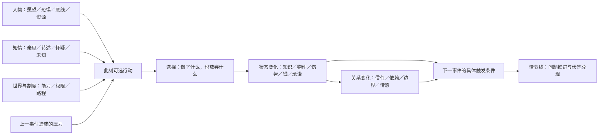
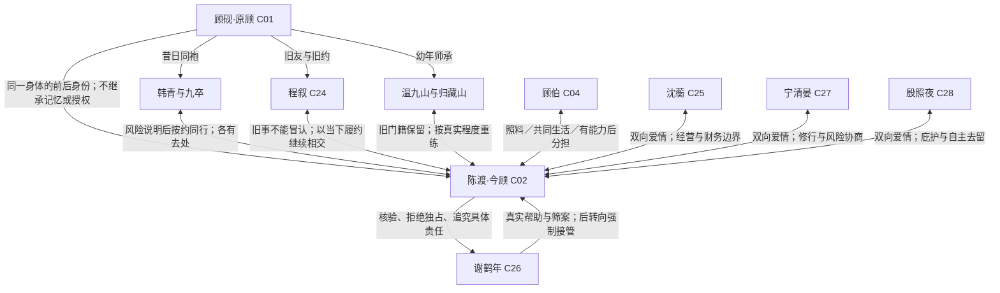
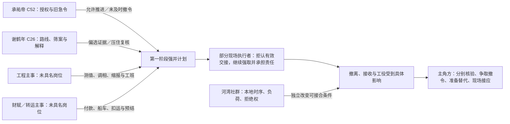
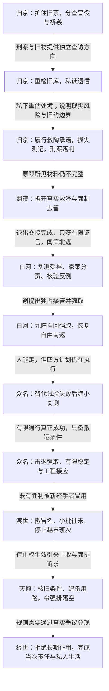

# 《经世》人物、事件与情节关系图谱 v1.0

2026-09-08｜作者用全剧图谱及推演工作稿，包含剧透。图谱整理现有设定与发展稿；本页的分支比较和推演表是编剧工具，不自动变成台本。

**先打开 [交互图谱](../索引/人物事件图谱.html)**，选人物查动机、关系与参与事件，选事件查前因后果、人物知情和所属情节线。文字检索见 [图谱明细](../索引/人物事件图谱明细.md)，维护数据见 [人物数据](../索引/数据/图谱人物.json) 与 [事件数据](../索引/数据/图谱事件.json)。

本版范围：**56名人物、70条人物关系、32个核心事件、47条因果连接、8条情节线**；挂靠33项原任务与8条配角关系弧。32个核心事件是对已有情节的归组，不是32集新剧情。

图谱回答三个问题：**这个人此刻为什么这样做？这一选择使谁不得不回应？这次回应怎样造成下一件事？**先找人物当时能知道、能做到的部分，再比较行动，不从作者想要的高潮倒推人物必须配合。

## 1. 依据与版本边界

| 层次 | 采用的依据 | 如何使用 |
|---|---|---|
| 世界硬边界 | [重境、修行与承接机制](../设定/重境、修行与承接机制.md)、[世界观与终局](../设定/世界观与终局.md) | 限制所有可选行动；不能靠新解释抹除死亡、伤势或物理损失 |
| 人物与关系 | [人物行为与群像总则](../设定/人物行为与群像总则.md)、[三位女主与感情线 v1.8](../设定/三位女主与感情线.md)、[配角关系回收 v1.8](配角情感线与关系回收.md)、[主角与近人传记](../设定/人物传记-主角与近人.md)、[群像与对手传记](../设定/人物传记-群像与对手.md) | 硬锁优先；传记新增的经历与具体未来动作仍是发展稿 |
| 穿越知情 | [穿越隐秘与现代知识运用 v1.7](../设定/穿越隐秘与现代知识运用.md) | 该专题明确取代旧版归京25—26公开身份、九卒知情、师门身份信等安排；不是仅按文件日期选版本 |
| 已写行为 | [前三集详细台本](README.md#前三集直接入口)、[资产连续性](../资产/连续性.md) | 判断前三集谁在场、谁看见、证物在哪；大纲摘要不能重写逐场动作 |
| 未来因果 | [全剧大纲](全剧大纲.md)、[剧情结构与推进](剧情结构与推进.md)、[主线任务](主线成长与任务总图.md)、[情感任务](情感任务与坚定选择.md)、[支线任务](支线与配角任务.md)、[后三篇推演](../设定/多端世界与七篇章推演.md) | 选择可用过程，保留胜利与代价；同一危机挂多个任务，不重复制造事故 |

“陈渡／今顾／原顾”是作者区分身份的标签。故事内来客仍使用顾砚的名字；人物关系总图不表示每个人知道这两个身份的差别。前四篇同伴与三女主不获穿越确证，后三篇也不自动解锁公开。未列出的知情状态是未记录，不是默认知道或默认不知道。

图谱采用三种提取状态：`台本提取`、`设定提取`、`发展稿提取`。它们说明出处的成熟度，不表示用户已逐条批准。人物行为规则是依据性格的条件式归纳，不是人物每次必然执行的程序。关系的变化触发条件是待检验的推演条件，不能当作已发生事件。

## 2. 四层结构怎样相连



人物节点沿用 C01—C56；EV 是本图的事件编号，R 是人物关系，CE 是事件因果，PL 是情节线。它们不新增角色、正式集数或场次，不替代现有 Q-M／Q-E／Q-S 任务标签及 Q-R 配角关系弧。事件选择代表性的状态转折，不声称穷尽七篇所有场景。

人物与事件是多对多：同一事件里有人想查证、有人想结工钱、有人只想安全回家；同一人物会因上一件事失去时间、受伤或改变态度。情节线是对事件的不同读取方式，一次撤离可同时推进能力、友情和责任，不必演三次撤离。事件涉及身份可以跨多场，也可能来自回忆或画外声；这份集合不表示他们同时在场，具体场景仍按台本核位置。

## 3. 人物核心关系图



此图是作者视角的关系总览，不是剧内的知情网络。九卒与近人只见旧事、习惯、伤势和能力有变化，不由连线自动识破来客。四位主角的紧张来自风险、信息、时机与各自生活；三段爱情均双向，不以争夺、牺牲退出或逼选来制造情节。依据见 [人物总则](../设定/人物行为与群像总则.md) 与 [保密专题](../设定/穿越隐秘与现代知识运用.md)。

关系需要跟踪的不只是“好感”：

| 维度 | 行为证据 | 可以同时成立的不同状态 |
|---|---|---|
| 信任 | 是否愿让对方知道坏消息、接受其有限证言 | 相信对方善意，但不同意其风险判断 |
| 情感 | 是否主动赴约、失约后补救、在无事可求时陪伴 | 相爱，但这次按自己的职责离开 |
| 依赖 | 钱、药、人手、身份或通路由谁提供 | 感激真实帮助，同时拒绝排他条件 |
| 承诺 | 对谁答应何事，到何时为止，如何交接 | 完成此次护送，同时拒绝下一程 |
| 权限 | 谁能决定哪些资源，谁可拒绝或撤回 | 商号出钱，但不能替岸工答应加班 |
| 伤害与责任 | 是否交出事实、赔付、接受审理 | 做过善事，同时对另一次伤害负责 |

每次只写被事件实际改变的维度。“救过我”不能一次性填满信任、忠诚、爱情和终身义务。

### 把感情变化也写成因果


| 关系 | 什么会刺痛 | 不同的本能回应 | 必须看见的修复 |
|---|---|---|---|
| 沈—陈渡 | 把她一次体谅当成随时可以改约 | 她用过分客气拉开距离；他继续给方案，没看见她已为私约让出的时间 | 她直接说明自己的安排；他认领失约，主动兑现下一次具体相约 |
| 宁—陈渡 | 正确救援之后，后怕没有被看见 | 她将后怕压成更严的安排；他把尊重职责误作无需事后照料 | 她承认私心并商量；他事后回来听完，恢复期按她所需帮忙 |
| 殷—陈渡 | 认真说想留，被当成惯常玩笑 | 她再用笑话撤回真心，停下邀约；他误以为事情已过去 | 她把真正的问题说完；他记得行程与喜好，主动组织下一次见面 |
| 章秋屏—沈蘅 | 一方被当作老管事，另一方被当作永远要代办的孩子 | 称呼与讨论变公事，两人不再先问意见 | 困境中各守一面，随后把职责、出资和决定权说给合伙人听 |
| 陆怀真—高成礼 | “你最熟”变成无限推迟外调 | 高收工便走，陆将此误读为不用心 | 定下并执行交接，陆自己补查，高教会替手；以后能赴不夹差事的私人约 |

以上来自 [三女主关系](../设定/三位女主与感情线.md) 与 [配角关系回收](配角情感线与关系回收.md)。不要求每次都先伤再修，也不把三位女主排成同一种受伤顺序。错误说清后即可开始处理，恢复靠行动；已经修好的问题不在下一篇自动重置。年饭、听曲、留棋位、来信与节令相约可以承载关系变化，也允许一段生活完整结束，见 [中式叙事补充](剧情结构与推进.md#chinese-narrative)。

## 4. 对手与制度图：每条责任都要有经手



工程、财赋、执令者与河湾代表保持岗位或社群位置，未新增 C 编号。四方责任不互相吞并；河湾有自己的限制，不能作救兵或无限容量。每一位对手也按“已知、想守住什么、可用手段、为何不肯放弃、造成什么代价”推演。依据见 [终局多方知情](../设定/终局多方知情与彼端主体.md)。

谢的帮助曾真实有效，因此陈渡会认真考虑他的条件；谢拒绝取消独占限制，才使拒绝与冲突成立。不能让陈渡因观众知道谢有问题就提前识破所有安排，也不能让谢凭主事身份知道陈渡的现代姓名、职业或事故。

## 5. 七篇主因果骨架



每条箭头都应说出下一步为何必要。查出责任不等于执行已经停止；打赢修士不等于地面恢复；一船到了不等于长期运转合算；给了拒绝权不等于当事人拒绝后有现实退路。这四种差别让后半程仍能产生新行动，而不撤回前篇胜利。具体节拍以 [主线任务总图](主线成长与任务总图.md) 与事件数据为准。

## 6. 知情层：角色只能使用已经到手的信息

| 信息节点 | 具备的信息／获知渠道 | 不能据此推出 | 会改变的行动 |
|---|---|---|---|
| 归京03：冒役说辞受到核验 | 赵平否认本班派人索票，王寿抢领条及持刃；领条本身不是有效派差公文，各人分别记录亲见 | 赵不能替全衙门担保；租车凭条不能直接确认梁、谢或合并桥袭链 | 护住票与现场，请官署分别核对索件链与桥袭链 |
| 归京23—24：遗信私读 | 陈渡私读；观众可见阅读回看；公共案证另行登记核验 | 顾伯、九卒、温或女主不因在重检现场就知道来客段落 | 陈渡重估自身处境；对外说明可核方向、眼前风险和做不到的旧约 |
| 归京25—26：重新约定协助 | 近人知当前查访、救陶和北行可能带来的风险、花费与退出条件 | 不等于他们确知原顾意识已死，也不是集体原谅新身份 | 各自决定协助范围；程可仍履行车约，九卒可只答应一程 |
| 白河：谢的接管条件 | 提供的药、住处、经费真实；不能独立离开与集中交材料的条件可核 | 不等于谢已确知承接成功；也不证明药有毒 | 陈渡要求保留离开及独立保管，谢拒绝后矛盾具体化 |
| 众名：三十息有限稳定 | 宁实际初证后，现场感知她正在支撑；作者掌握上限 | 人物事前不能知道首次一定成功或精确承诺三十息 | 接应先备好；出现支撑后完成当下工作，宁按边界退出 |
| 现代尾声 | 母亲、杨舟知道现代死亡与往事；观众看到独立生活继续 | 乾朝人物不获信息，现代亲友不知承接，无跨世通信 | 作为观众的情感回收，不给乾朝主角提供线索或资源 |

前三集证物另查 [P04 旧票](../资产/道具/P04-北路旧票与褐色小布套.md)、[P06／E1a 领条](../资产/道具/P06-王寿手写领条.md)、[P07／E1b 租车凭条](../资产/道具/P07-王寿租车凭条.md)。P04仍由顾府保有；P06、P07分别交巡防登记。今顾、韩、杜见P07掉落，孟达负责拾取，不能代替未亲见的掉落作证。

信息转移单独记：**内容—谁给谁—通过什么—什么时候能到—是否核实**。听说与亲见分开；摘要与原物分开；一人看过卷宗不等于同阵营共享。长京到朔北有人货路程，急递也有时差；未知送达时间先标“待设计”，不能让跨篇人物即时开会。

## 7. 一次推演的实际做法

1. **固定截点。**选择一个事件进入前的时刻，列在场者、伤势、钱、人手、持物、前约和停止条件。不要把全剧总图当成此时快照。
2. **固定知情。**每人分别写亲见、可信转述、猜测和未知；给关键消息标渠道。新增消息就要补传递事件，不能直接改“已知”。
3. **排出候选，保留至少两条可行行动比较。**包括拒绝、延后、请求帮助或按旧法尝试。先剔除违反能力、权限、世界和人物硬锁的分支；若只剩一种，检查能否缩减、交接或延期。确实只能做一件事时，张力应来自如何完成及付出什么，而不是声称有选择。
4. **按人物的排序选。**同一资源不足，沈先查亏损能否承担，宁先问未测风险，殷先问当事人是否愿意，陈渡先找能验证的具体差异。真实恐惧或盲点可能使某人选错，但错误要有此前性格与当时证据支持。
5. **让其他人分别回应。**先问对方自己的目标是否受损，再写配合、谈条件、纠正或反制。不能只写主角选了什么，不写别人为什么让他做成。
6. **结算并回写。**记录成功、失败、永久损失与关系变化；让其中一项成为下一事件的触发。若分支被选入正式稿，先改所属设定／大纲／台本，再同步图谱。

不把复杂动机压成“好感80，所以愿意牺牲”。可比较的是：哪条路目前可做、哪件东西人物最怕失去、什么代价已经被他承认、什么证据会让他改选。

### 可复制的推演卡

```text
推演编号：SIM-日期-序号（仅工作编号）
挂靠事件／剧情位置：
状态：假设分支，尚未选入台本
本次只改变的条件：
原始状态：位置／时间／伤势／资源／物件保管／承诺
人物甲：想要／害怕／底线／亲见／转述／猜测／未知
人物乙：想要／害怕／底线／亲见／转述／猜测／未知
行动A：能否实施／符合什么欲求／牺牲什么／谁承担成本
行动B：能否实施／符合什么欲求／牺牲什么／谁承担成本
本次选择及理由：
对方可见的反应与反制：
实际结果：预期中／意外但有铺垫／失败
状态差额：新知／物件转手／钱粮／时间／伤势／关系／承诺
下一事件：由哪项差额触发
反证：出现什么证据，就应放弃本次推论
需补的前置镜头或传信：
需修改的原始文件：
```

## 8. 四次演算示例

以下比较是本轮推演示例。所用事件与人物限制来自现行发展稿；未将比较中的备选分支补写成已发生的事实。

### A. 王寿来索旧票：为什么不立即交票，也不直接指认主谋？

- **截点：**归京03；旧票在府内，来人自称公差，今顾不知道完整旧案；九卒能保护现场，不能代官署审判。
- **A：立刻交票。**能暂时减少门口冲突，但交接资格未核，且让唯一手中原票脱离保管。与刚遭追杀后谨慎核实的欲求不合。
- **B：先写明交接，再请真差核验。**能利用现成人手和官署常规，既不必知道幕后，也迫使来人回答可核的问题。代价是耗时并引发对方抢毁的可能，需九卒在场保护。
- **C：先不作交接，请来人等候进一步查验。**同样可做，能暂保旧票，却还未留下对方自己写明的索件说辞，可能失去一个可追经手。是否先要求书面说明，来自陈渡对眼前行为的观察。
- **选择与后果：**采用B的逻辑；赵平否认本班派人，抢毁未遂、持刃受制，P06与P07分别保全。下一步分查租用与袭击，不从一张租单直接跳到梁、谢。
- **反证：**若出现真实有效的派差与完整交接，便不能只因他态度可疑继续当作冒役；需由新证据改变判断。

### B. 私读遗信之后：守住秘密，怎样仍允许近人自主选择？

- **截点：**归京24后；陈渡理解增加，近人未读来客段落，陶七的接应仍是现实承诺。
- **先排除A：继续用旧约要求所有人无条件跟随。**能省去解释，却隐去当前风险，并利用自己无法核实的旧情越权；不符合人物底线。
- **B：说清当前查访、费用、危险和自己的能力限制，重新约定一程。**不泄露穿越，也不冒认记忆。代价是有人可能缩小帮助，陈渡须接受少一些便利。
- **C：暂缓新增北行邀约，先只协商已经答应的救陶接应。**也保留秘密与拒绝权，更容易明确眼前能力；代价是北路调查准备延后，未解决的追索压力继续存在。B与C的区别在是否已有足够条件说明下一程，而不在谁更忠诚。
- **选择与后果：**采用B；程可以暂不作保却仍履行自己答应的车约；九卒分别同意具体期限。救陶源于各自承诺，不是他们认出来客后集体原谅。
- **反证：**如果救援计划仍把未说明的危险转嫁给同行者，就没有完成知情协助；不能用“保密”替这项遗漏辩护。

### C. 谢提出保护：为什么拒绝一份确实能减轻痛苦的好处？

- **截点：**白河后段；伤后恢复有实际需求，谢曾提供真实帮助，但接管条件限制离开和独立保管材料。
- **A：接受全部条件。**近期药费、住处和调查压力减轻；代价是选择与复核渠道集中于谢，触及刚经历筛案后更在意的自主边界。
- **B：要求取消排他限制，可接受其中独立成立的帮助。**先给谈判真实空间；谢不肯取消核心限制，才有具体拒绝理由。
- **C：拒绝这份整套安排，继续依既有照料并暂缓扩查。**可行，却承担恢复与费用压力，也暂失谈判所得；选择B是先核清边界，不能据此保证谢一定让步。
- **选择与反制：**B推进后，谢方强取；九卒挡回武力，温公开见证，陆的有效文移另行发挥作用。自由南返成立，但各地执行并不随谢失去这一个人而停止。
- **关系变化：**感激真实恩情可以保留，对其无条件信任下降；下一步转向仍在运行的工程、预算与授权。不能靠一句“他原来全是假装”取消这层背叛。

### D. 沈愿意帮忙：为什么仍拒绝签三年独家？

- **截点：**渡世试运后；一次抵达已兑现，空载和岸工等费用真实发生。联营方愿包亏损，以三年独家班次为条件。
- **先排除A：为眼前亏空答应长期排期。**短期解压，却超出沈能替岸工、住户和其他合作者承诺的范围；陈渡的经历也不能充当永久担保。
- **B：缩小下一批，摊明失败账，寻找有限分担。**更慢、更费钱，眼前账面更难看，但保留双方停止权和经营权限。
- **C：暂停下一批试运，先结清当次责任，等待新的自愿分担。**也能保住权限，短期少冒经营风险；代价是已经积累的商路机会与后续收益推迟。B只有在缩小后的损失仍可承担时才成立，不是因女主必须继续帮男主而成立。
- **选择与关系：**发展稿采用B。陈渡帮她把货搬回并分担已承诺的事，而非用爱情要求无限出资；“被理解”发生在真实亏损之后。
- **下一压力：**一次成功被摘要放大，预付款与居民同意不匹配，于是产生下一次必须真停班、处理当次退款与去向的事件。

## 9. 扩写时最容易断掉的地方

| 如果这样写 | 因果哪里断了 | 补什么才成立 |
|---|---|---|
| 配角突然认出来客并原谅 | 将作者秘密直接变成角色确证，违反保密范围 | 只对可见变化与当下承诺反应；后期披露仍须另定 |
| 拿到领条就查清桥袭 | 两条执行链与两件独立物件被混并 | 分列时间、目标、租用、付款与经手的互证 |
| 九卒缺一便全阵报废，或打赢便填回地面 | 抹掉既有阵法能力或越过物理边界 | 小阵、九齐强度各兑现；战斗与工程接续分别完成 |
| 宁提前承诺必有三十息 | 把作者上限当成角色的事前知识 | 准备不依赖必然初证；实际发生后按现场边界行动 |
| 女主帮一次就永久跟随 | 抹除经营、轮值、庇护及私人时间 | 标期限、权限与返回安排；让分途仍保有爱情 |
| 撤令发出便三地全部停工 | 省略送达、交接、拆改和执行选择 | 各地分别建立生效时点、经手和替代工作面 |
| 配角只为送线索出场 | 没有自己的即时目标和回报 | 先完成见家人、结工钱、谋生等事，再给自愿的有限证言 |
| 下一篇又由谢幕后操纵 | 撤回阶段胜利，吞并新的行动责任 | 以新经手、新授权和真实利益形成后续对手 |

这些是叙事核验，不要求给每个动作加解释台词。允许人物怕、赌错、偏私、迟疑；但必须能从其所知、欲求与实际限制追溯到那个选择。

## 10. 维护与已知留白

在项目根目录运行：

```powershell
python 工具/图谱管理.py build
python 工具/图谱管理.py check
```

`build`读取两份图谱数据，生成合并JSON、明细Markdown和无需联网的HTML。`check`核验人物编号、引用路径、任务编号、因果有向无环结构、情节线顺序及生成内容是否与输入一致；源文档改变时提示重新核对提取内容。脚本不能判断人物行为是否合乎人性，也不能证明文字与来源逐句一致；语义仍按上面的演算方法复核。

图谱中的人物关系覆盖不同阶段，事件知情只记核心变化；尚非逐场完整状态数据库。源文档未明确的传信日期、旁听范围和后期是否披露，保留未定。工程／财赋等岗位未锁名字；最终婚恋形式、发行拆集、完整台本选用也不由图谱决定。

新写一场时先复制一张推演卡。只改一项触发条件，沿事件的直接后继检查人、消息、资源与关系；需要改变旧事实时回到其原始文件，不在图谱里悄悄另立一条故事。

### 本次核验记录

- 人物编号与姓名对齐现有登记，来源及Q标签有效；事件因果顺序无环，情节线按结果落定次序排列。
- 对悬空人物关系、反向因果、不存在的任务和未登记知情者进行反例检查，工具均拒绝。
- 以真实数据在轻量DOM环境检查96个节点渲染、搜索、筛选、跳转、便签固定挂靠及导出文本；代码层通过。独立语义审阅核对了保密、情感硬锁与前三集证物，并修正本班权限和可行分支表述。
- 内置浏览器策略阻止本地HTML预览；未绕过该限制。浏览器实际视觉布局、剪贴板权限及下载落盘行为尚未实测，代码层检查不替代这些验证。
