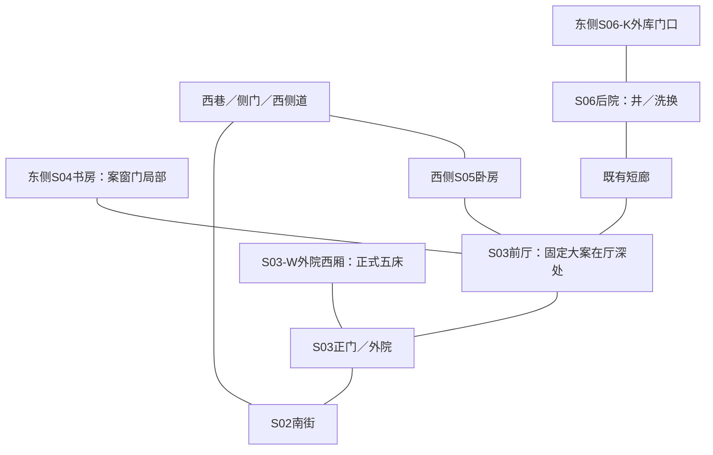

# 城市、场景与建筑补充及 Blender 备选方案

2026-09-10｜三维路线暂停，当前仅作备选。用户要求所有内容先不建模，主线采用剧情、二维分镜、参考图与视频生成交接；以下三维技术细则只供未来启用时参考，不构成当前任务或前置条件。共用空间灰模、五镜43秒技术预演、生成输入与一张美术候选见[当前交付](三维预演/README.md)。新增形制细节与尺寸仍为工作假设，AI视频未生成，正式美术及动作未通过；不新增正式C／S／P、场次、镜头或生产任务号。

## 1. 备选路线（当前不执行）

**先用城市关系图统摄地点，再以顾府共用总装和S01林道建立可复现空间，按已有镜头做灰模预演；关键建筑背景优先保留三维渲染，人物与局部效果按实际能力接入生成流程。**

目标不是让每镜使用相同的运镜，而是让每次推、拉、摇、移和正反打都发生在同一个可解释空间：门窗不换边，路不变窄，人物到得了目标，相机转过去看见的是同一栋建筑的另一面。

Blender中的相机和空间可以固定；视频模型是否保留它们须另行实测。把灰模首帧交给图生视频，只能提供起始画面参考，不能据此承诺完整轨迹、遮挡与时间一致。若某镜要求精确复现，须保留确定性渲染的背景与遮挡，或采用已经实测通过的逐帧控制流程。

现有178项任务、71个分镜工作单元仍按原计划登记；五镜已有技术预演，其余66镜尚未预演。现行MJ母版任务与三维预演分开登记，技术样片不自动完成母版任务。

## 2. 已有依据与缺口

| 层级 | 已确定 | 如启用三维时补充 |
|---|---|---|
| 城市 | 长京北官署、东货栈水关、南旧军户街与顾府、西谢园；城西归藏小院独立存在 | 分区轮廓、建筑密度、高度层级、交通和远景遮挡；不先锁整城尺寸 |
| 城外归途 | 林道受袭→前方林口→春泽桥→南城接道；桥被转弯与竹木遮住 | 道路横断面、人车完整包络、遮挡树位、桥与林道的可见边界 |
| 顾府 | 南门北厅，东书房西卧房，西厢、侧道、后院短廊与东外库相连 | 同一坐标中的总平面、标高、开间、门窗、屋顶与人物／相机通行 |
| 建筑美术 | 高门世家厚梁深檐、重工家具；日间明媚中性、夜间局部暖灯 | 构件家族、形制比例、立面转角、材料实尺度、光源位置及昼夜状态 |
| 镜头 | 71个父单元，24/1fps、16:9工作假设；180／195／180秒 | 逐镜坐标、焦段与传感器、视线轴、走位时长、遮挡和可复现输出 |
| 生成接口 | 已有本地预演和空景输入；Runway无可用视频模型，小云雀CLI未登录；未选定视频模型 | 接通账号后核模型版本、参考输入类型、时长／尺寸／帧率限制与控制保真度 |

依据：[世界观“天下与长京”](../设定/世界观与终局.md)、[归藏山与师门](../设定/归藏山与师门.md)、[场景卡](场景/README.md)、[美术总则](美术风格与造型总则.md)、[前三集逐镜表](生产准备/前三集-v1.9/前三集节奏与分镜.md)。更细的现行场景规则优先于本文提案。

## 3. 城市与地域：先补“为什么长成这样”

### 长京的总体描述提案

长京呈现为长期经营、不断修补扩展的都城。远看是高低有序的青灰屋面、成片深檐与少数体量突出的公共建筑；近看才分出官署、商栈、世家宅门和普通营生。繁华来自密度、工艺与人在其中活动，白昼保留白墙、木色与石面的自然颜色，夜间则由仍在营业的店檐、摊灯与院内灯具形成断续光带。

规整主街连接城门与公共区域，细巷顺生活和经营形成转折；不把所有街道拉成同宽同高的背景走廊。城市外轮廓暂用可调整体块，不预设皇城具体形状、城墙周长、城门数量或河道完整走向。

| 地区 | 建筑与生活描述提案 | 镜头用途与边界 |
|---|---|---|
| 北部官署区 | 较完整的院墙、清楚的台基与门序，体量整齐；候办、交件和人员出入体现机构运行 | 适合层层门框与礼序纵深；不因镜头需要把顾府挪到宫门旁 |
| 东部货栈与水关 | 较长的仓屋、装卸前场、可收拢的遮雨棚和便于搬货的门洞；磨损集中在门槛、转角与搬运落点 | 沈蘅经营与运输需要真正可走的货路；河岸高差、水位和泊位待对应剧情细化 |
| 南部旧军户街与顾府 | 普通店面与高墙宅门共处，汤摊藏在檐边，街面既容人马行进也容收摊扫水；顾府以门楼和深檐显家底 | S02到S03保持一段实际街面；日常夜景不自动升级为整街上元灯海 |
| 西部谢园与归藏小院 | 谢园可用较完整围墙、深层院落形成私密和秩序；归藏小院为城西租用授业住处，门庭与练习庭院更紧凑 | 两处独立，不能混成一园；顾府到归藏小院仍保留半个时辰至一时辰的现行路线预算 |
| 春台院与灯市 | 春台院围绕台口、看棚、观众席和后台修衣组织；灯市按节日临时加设灯架与摊位 | 春台院暂名沿用，不等同听雨楼；具体街区未锁，不擅自放到顾府隔壁 |

**城市模型只先建关系与天际线。**精细范围集中到S02街段及与顾府连接的西巷。货栈、水关、谢园等先完成建筑类型描述与占位，待具体场次、出入口和动作明确后再制作场景资产。

### 后篇地域的可区分方向

| 地点 | 现行角色 | 建筑与地貌提案 | 当前建模深度 |
|---|---|---|---|
| 桃汀渡 | 京畿北缘水陆转接地 | 岸线、高差、渡运前场与仓棚形成层次；陆路排队处和实际上船处可分辨 | 关系示意，待水位与救援路线锁定 |
| 回雁驿 | 北道中段粮药驿镇 | 长向驿院、遮雨装卸廊、分开的货物与住宿空间；尺度来自转运与轮班 | 关系示意，待车队和交接动作 |
| 石门屯 | 白河南缘接纳遗属 | 屯居、岸工、临时安置与旧构痕迹并存，不能全做废墟 | 关系示意，待故道和安置场次 |
| 白河旧城 | 已被毁且不复原 | 遗存边界与不能再通行的原路径明确，幸存地带有当下生活 | 暂不精建，不以美术复原改写旧城命运 |
| 归藏山 | 距长京约一日正常行程 | 主院、练剑坪、小书室与山田；住宅修补和种植体现常住 | 独立布局提案，不做悬空巨型仙宫 |

南水关仍是长京旧支点，与桃汀、回雁、石门不同。以上不分配新S号，也不增加前三集出场地点。

## 4. 场景与建筑：按镜头补描述

### S01：宽官道中的近林局部

日间量尺态先看清夯土路基、路肩、边沟与林线。竹丛和高树在右侧形成可分辨的前、中、后层，车停处留出右门开启、踏阶下车和扶人站立空间。近景压迫感来自人物附近的树干、车体遮挡与雨夜可见范围；路的其余部分依旧宽阔存在。

把两件事分开验：**路为什么这么宽**由八列完整车驾包络证明；**人物为什么不能马上离开**由已有剧情中的伤体、扶人接续和受牵制时间证明。不能靠缩路、添深沟或新机关补逻辑。如果按现有动作仍能轻易离开，就把问题退回动作与节奏评审，不用美术隐瞒。

首次灰模只做人车代理体、固定车门和树干遮挡。四驾与四坐骑分组；第一波十人、第二波五人、C60分开管理显隐。只核镜头中的人数、通行、时间与遮脸，不在此设计现实围杀阵位或武器动作方法。桥设可见性占位，当前战斗机位不能看见桥身。

### S02：可连续抵达顾府的街段

顾府外墙与精整木构店面形成街道两侧，檐口高低有序，汤摊的棚缘、锅沿和蒸汽提供近景；中景保留六人四马经过的实际宽度，远景由街道轻微转折与叠檐收束。夜晚收摊、清晨卸货共用同一排门窗与沟沿，只更换营业和天气状态。

必须画出正门、侧门、西巷口、汤摊与赵孟查问处。后续门口单元的看见与听见来自明确站位；不把所有人摆在同一点，也不靠穿墙视线。街长和楼高可以先占位，关键听见距离需结合说话强度与环境声试读，几何图不能单独证明声学结果。

### 顾府总装：S03、S04、S05、S06共用一套空间

顾府用高门深檐、粗柱与层叠院落体现宏大；近人空间以柱间、罩屏与家具组合收住尺度。精养痕迹来自完整门漆、洁净石面和贵重木器的维护，局部使用磨损来自真实生活。闲置房间可关闭，不用破败表达现银有限，也不凭新增仆役和灯火制造无限家用。

正门与前厅形成南北轴线；东书房、西卧房、外院西厢与后院短廊维持现有关系。以下仅表达邻接，不替代待绘制的带尺寸平面：

| 部位 | 补充描述提案 | 必须先验证的空间条件 |
|---|---|---|
| S03门楼、外院、前厅 | 厚门扇、完整石础、粗柱、深出檐与青石中轴；花木山石沿两侧；前厅以厚框屏风、立柜和重工大案形成稳定层次 | 门扇全程扫掠范围；扶人入府；小退相机能停在门侧；无中央水池 |
| S03-W西厢 | 正式架子床、柜具和个人物品构成住用单元；可试两床／两床／一床的相通客房分配 | 五床逐间核数；开门、床边和卸甲器物区不冲突；分房方案未锁 |
| S04书房 | 前部紧凑行动区，外围阅书、会客、休憩层次；罩屏与柜架丰富前后景；厚案沿、矮柜、格扇窗和内闩均可操作 | 同一机位能读案窗门三角；门外等候者能及时靠近；窗朝府内；铜镜反射不露假空间 |
| S05卧房 | 深雕床楣与厚柱架子床，帐幔收两侧；床边案、温水和护理位置有层次 | 郎中收拾后出门、顾伯回床、韩放行囊各自通行；左右手与肩伤方向不被反打翻转 |
| S06生活后院 | 延续木作与石材家族，但装饰密度低于正堂；井、水盆、木桶和衣架沿杂务区排列 | 韩洗换与杜的短廊交接成立；不阻塞值守；外库仍在东侧 |
| S06-K外库门口 | 厚木门、铜件、门框进深和近廊灯形成普通库房入口，干衣箱只按既有可见范围露角 | 首夜无封条；相机不跟入库内；不透过门缝、镜面或穿帮模型泄露隐室与P13 |

书房与外库不为建模便利新增地道。门口小案是可移动道具，前厅大案是固定陈设；两者在模型里分别命名，不能随镜头需要互换。

### S07：保持局部

只需要岩面、稳定落脚面、衣袖、手和绳具附近的接触关系。建议先用局部代理体核构图；没有大幅视角变化时，可用经确认的局部图像，不为六秒记忆建整座山，也不增加坠落和现代正脸。

## 5. 哪些先建，建到多细

| 对象 | 必要深度 | 理由与投入边界 |
|---|---|---|
| S04＋门外近廊 | 首个灰模试点；通过后细化可见木作、案窗门与镜面 | 小范围即可验证空间、人物接触、镜头和生成接口，返工范围较小 |
| S01＋P01＋八马代理体 | 高优先级灰模；只有通过覆盖的近树、路面和车体做较细模型 | 多人、多遮挡和出入场最复杂；先验证，不先雕满整片森林 |
| 顾府S03—S06总装 | 共同总平面必须先有，细化按镜头覆盖逐区推进 | 多集复用，不能把四张S卡建成四处互不相干的宅邸 |
| S02街段 | 与顾府正门和侧门相接的三维街段；远端简化体块 | 跨街视线、步行和正反打需要；整条商业街暂不精建 |
| S07 | 局部接触模型或受限视角图像 | 单次短记忆，按接触与视角变化决定 |
| 全长京、后篇地点 | 关系图、轮廓体块和建筑类型样本 | 先解决方位与出行，未入镜地区暂不投入高精度 |

细节按三个用途分配：影响轮廓、视差、接触和投影的做几何；只影响近景表面观感的做材料；远处未被视差揭露的用简化体块或经验证的背景。决定标准是相机可能看见什么，而不是统一面数预算。

## 6. 尺寸与模型交接要求

以下数值只是第一轮量尺假设，不是新增世界硬设定或实拍安全标准。先用各角色实际身高比例与完整车马代理体走一遍，再决定是否锁定。

| 参数 | 灰模工作假设／推导方式 | 核验方法 |
|---|---|---|
| 坐标 | 米制，右手系，X东／Y北／Z上；顾府正门门槛中心为宅区原点 | S02—S06共用宅区根变换；城市总图另有坐标，显式记录映射 |
| S01路宽 | 通行宽度≥8×W＋7×G；W为P01含四驾挽具的完整横向包络，G为相邻包络间距；边沟不计通行宽 | 八列代理包络正交量尺；W、G仍待车马比例确认，不先报一个伪精确路宽 |
| 门口有效净宽 | 暂试2.4—3.0米 | 两人扶一人、门扇开合和固定机位均可成立；净宽不等于门楼总宽 |
| 主要廊道净宽 | 暂试2.0—2.4米 | 柱础与家具扣除后，扶人和短程交接不碰撞；不足再调整 |
| 书房案窗门局部 | 暂在约4×5米内组织，整间书房可更大 | 既定10秒动作含观察、停顿与伤体移动，不可把全部时间当行走 |
| 床边主要护理侧 | 暂试1.2—1.5米净空间 | 以郎中、顾伯与伤者代理体及相机检视；不先改床高 |
| 外院与前厅距离 | 根据入府、交接、门口听声和走位预算推导 | 先复演再锁；宏大主要增加檐高、屋面与外围层次，不任意拉长短动作 |

每个建模单元交付：带北向和标高的总平面、关键剖面、门窗表、入口与连接表、固定锚点、材质表、昼夜状态、相机可用区与遮挡区。图上的每一个门洞都要能在三维里找到。

结构、门窗、固定家具、活动道具、植被、光源、演员代理体、相机分别组织。对象名称沿既有资产归属，例如`S04_Window_Court`、`S03_Table_Fixed`与`S03_Table_Moveable`只是模型内部名称，不是新资产编号。随机植被锁定种子，控制遮挡的树干直接固定位置，不随重建漂移。

未来文件采用共享资产＋镜头引用：顾府母场维护S03—S06公共建筑；镜头工程只保存该镜相机、动作与状态差异。跨文件链接及必要的局部覆盖可参考Blender的[Library Overrides文档](https://docs.blender.org/manual/en/5.0/files/linked_libraries/library_overrides.html)，正式实现须按实际安装版本核对；不逐镜复制一座宅院后各改各的。

每个逻辑资产只留当前工作文件，历史摘要进根CHANGELOG。当前构建已关闭会话内`.blend1`历史副本保存，保留可重建源；白天／雨夜等有效剧情状态不作历史副本清除。实际`.blend`、渲染和生成候选的范围见交付说明，不用空文件冒充资产。

## 7. 把“运镜一致”写成逐镜规格

| 逐镜字段 | 内容 |
|---|---|
| 绑定 | 原发行父镜ID、原SC、S区、状态、实际采用的场景文件与内容校验值；未建模时留空 |
| 时间 | 沿24/1fps、16:9工作假设，起止采用左闭右开；另记录剪辑全局帧与本地帧映射 |
| 相机 | 位置、朝向、机高、传感器／sensor fit、焦距、对焦距离、光圈、裁幅；推拉与变焦分别记录 |
| 运动 | 起始、注意力变化、停止、稳定尾点；位置、旋转、焦点分别设轨道与插值 |
| 走位 | 人物起止锚点、视线、交接／接触时刻、遮挡顺序；不以改相机偷偷加速人物 |
| 轴线 | 本镜所在轴侧、入出画方向、下一镜承接；换轴必须有可读依据 |
| 场景状态 | 灯、门窗、地面干湿、家具、车马、人物和波次显隐、道具归属 |
| 验证 | 可见地标、门窗数量、反射、穿帮、首末接续、是否泄露当前不可见信息 |

Blender可用曲线与Follow Path组织相机路径，并以独立朝向控制注视点；具体参数按实施版本确认，见[官方路径约束说明](https://docs.blender.org/manual/en/4.5/animation/constraints/relationship/follow_path.html)。轨道平滑不等于镜头有效，必须在动作可读之后调整速度曲线。

镜头文件使用现有`GJ-R02-SH016`等父ID。71行中有组合覆盖和时间省略，不能机械做成71条连续长镜。需要子镜时先在原源登记父子关系，子镜总时长包含切换、不得超过父单元预算；不擅自增加发行时长。

### 首轮试点：已有镜头，共43秒工作预算

| 父镜 | 原预算与动作 | 此次预演要证明什么 |
|---|---|---|
| GJ-R02-SH016 | 10秒／固定中全景，沿案到窗柜并观察 | 同时读清案、窗、门；伤体的行走与停顿时间成立 |
| GJ-R02-SH017 | 10秒／同轴中景，起动受阻后靠柜坐下 | 柜面、膝部、肩伤和支点连续；不靠剪碎动作掩盖接触错误 |
| GJ-R02-SH019 | 10秒／由窗转门，扶案站起 | 视线和朝向与前镜一致，门真实可达；中间SH018虽不列技术样镜，动作末态仍须承接 |
| GJ-R01-SH002 | 7秒／全景短侧移后停，28—35mm意向 | 宽官道与局部车旁空间同时成立，右门与八马分组可辨，桥不露 |
| GJ-R01-SH021 | 6秒／双层中景固定，从黄移焦到树后灰袖 | 固定树干遮住脸与手，不绕树揭秘，不暴露C60身份，介入手段仍留白 |

前四项可分别测试几何、接触、相机旋转和侧移；第五项只测遮挡保密。以上是从已有镜头选取的技术样本，不串成新的剧情片段。开始制作时须再核原源帧窗；不以本文摘录覆盖发行数据。

## 8. Blender到视频的三种接法

| 接法 | 输入与用途 | 可以依赖的控制 | 风险与退路 |
|---|---|---|---|
| 多视图／首尾图参考 | 同一个模型渲染起止与关键视图，适合固定、轻推或短局部 | 保持参考图出自同一空间 | 中间轨迹和被揭露区域仍可能重建；逐帧失败则转关键背景直出 |
| 灰模视频／条件序列 | 把预演视频及平台实际支持的深度、遮罩等输入模型 | 控制能力以选定平台实测为准 | 不默认支持深度、法线、多参考或相机数据；不支持的通道只作人工核验 |
| 三维背景＋局部生成／合成 | 建筑、门窗、镜面和关键遮挡从同一相机渲染；人物与局部效果分别处理 | 保留的三维像素可精确继承相机和建筑 | 人物透视、脚底、影子、反射仍须匹配；人物转身／接触失配时需三维动作或更受限覆盖，不能只贴二维人物 |

**推荐按镜选择的混合接法。**固定近景可先试参考图路线；书房与门口的连续空间、林道侧移与揭示镜，优先验证视频控制或直接保留背景。暂不承诺某个平台能够直接读取`.blend`、相机JSON或所有通道。

每个样镜先交付灰模视频、同相机无人物背景、首／关键／末帧、带ID的俯视核对图与相机表。需要合成再补线性EXR、深度、法线和物体遮罩；Blender的渲染通道可输出深度／法线等，Cryptomatte用于对象或材料隔离，见[官方Passes文档](https://docs.blender.org/manual/en/4.5/render/layers/passes.html)。这些是三维与合成能力，不是视频模型支持证明。

深度必须声明单位、近远范围和编码方式，不逐帧自动归一化；法线声明坐标空间，数据图不套显示调色。观看用图像、线性合成文件和条件数据分开输出。项目记录实际色彩管理配置与显示变换，不重复烘焙；白墙与白布的自然颜色、深木暗部和局部金饰按已有美术要求检查。

模型若只支持其他帧率，须记录原始帧率并单独制定转24fps方案，比较运动与动作同步；不能只改文件标签。最大时长不足时按原镜头内部动作节点设计子镜／切接，边界姿态与道具状态承接；延长与续写能力同样先验证。

## 9. 验收：用结果决定投入

| 检查层 | 通过条件 | 不通过时优先改哪里 |
|---|---|---|
| 拓扑 | 同一门窗／柱列／街口在正反打中数量、方向与连接不变；无新增水池、地道或桥面战斗 | 母场与锚点 |
| 通行与时间 | 人物、扶人组合、车马与门扇不穿实体；观察、停顿、交接在原帧预算内成立 | 场景尺寸或动作节奏，不能单靠缩镜头遮掩 |
| 保密与人数 | C60脸和身份不露；首夜外库不露隐室与信；第一波退净、第二波再入；四驾与四坐骑不混 | 显隐状态、遮挡与机位 |
| 运镜 | 相机不穿实体，地平线与轴线有依据；起止与关键注意力变化可复现 | 相机轨道、焦距与构图 |
| 生成保真 | 所有硬拓扑和状态条件通过；脸、肢体、门柱不融化；静止建筑无无故呼吸或漂移 | 先区分生成漂移和原模型错误，再选局部重做或保留三维背景 |
| 风格与光 | 同一木作、比例与材料跨镜稳定；白天自然明媚，夜光有来源；前景人物受光能落在背景里 | 材料、场景光或合成匹配 |

生成样镜暂以画面对角线1%作为静态地标投影偏差的复核触发值，属于工作提案，不是行业标准或“误差以内全合格”。统一画幅和时间后，取门角、柱脚、案角等地标对照；遮挡转换、窗柜接触、门闩、镜面和关键物件必须逐帧目检，数量／归属／可见信息错误直接退回。按25%间隔抽帧只能作快速筛查，不能证明整段通过。

资源先测再估：灰模用低分辨率预览；较细场景先渲染有代表性的起始、运动峰值和结尾，再跑完整样镜。记录搭建人时、峰值内存／显存、每帧耗时、生成耗时、每个通过镜头的修正量及费用，按复用镜数估算全段投入；目前不承诺天数、面数上限或费用。

可提议同一控制路线最多两轮有明确单变量修正的试验，仍无法保持硬条件就转直接背景／调整覆盖评审；预算和实际付费执行另按用户明确要求。没有实际输出不记录通过率，不把工具结构检查当视觉验收。

## 10. 执行阶段与当前待定

| 阶段 | 产物 | 进入下一步的依据 |
|---|---|---|
| 空间设计 | 长京关系图、顾府总平面、S01横断面、S04局部平面与尺寸表 | 既有方位、通行、行程、保密规则成立；尺寸仍可迭代 |
| 灰模预演 | S04＋门廊和S01局部、上述五个样镜 | 镜头覆盖、人数、接触、遮挡、时间和物理空间通过 |
| 最小生成验证 | 对选定样镜测试参考图、视频控制或背景合成；记录实际模型版本和输入输出 | 以真实回传媒体比较，而非平台宣传或漂亮首帧 |
| 资产细化 | 顾府木作家族、街段模块、近景树路、车体；锁定昼夜状态 | 只细化通过机位可见的区域，且不改变既有拓扑 |
| 扩至现行71镜 | 保留父ID的逐镜相机、状态、渲染与生成交接 | 已证明的流程按镜复用；总时长、对白与叙事仍须试读和剪辑复核 |

当前已用脚本在本机Blender 5.2.1完成试点；GTX 1660 SUPER 6GB、约16GB内存，预演采用16:9、24fps、960×540。仍待明确可用的视频账号／模型与参考输入、最终交付分辨率、预算、工期与可接受的三维背景占比；这些会决定后续资产精度和生成接口。

与既有生产衔接：`POST-PLAN-FOREST`、`POST-PLAN-COURT`继续代表空间核定要求；未来若用灰模完成，须将实际文件、量尺结果和审核记录绑定回原任务。通过前不解除相关母版依赖；不复用停用任务ID，不暗中改变178项计数。正式采纳本文要求时再原地更新相关场景卡、来源登记与生产规则，并运行资料／图谱／生产包构建检查及对应回归。

**已有本地空间及技术试点保留作备选，具体产物与限制见[三维交付](三维预演/README.md)。当前不继续扩模或渲染，也不要求用三维空景作为视频生成的首轮输入。后续按剧情和二维分镜准备合适参考、起始画面与分段动作，实际片段继续核对空间与连续性。**
