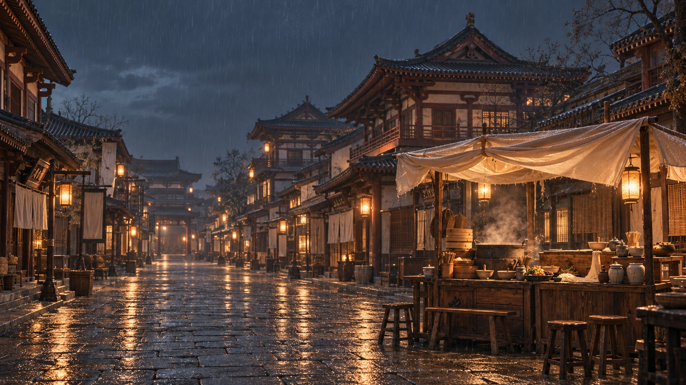
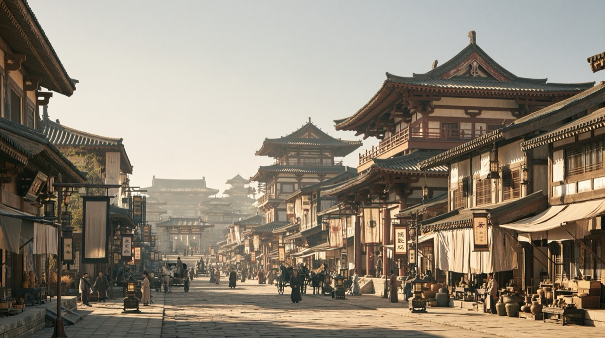
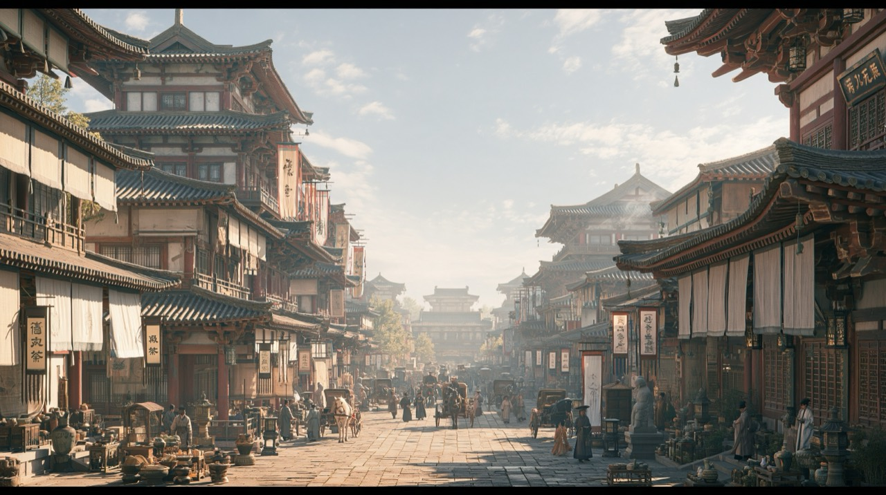
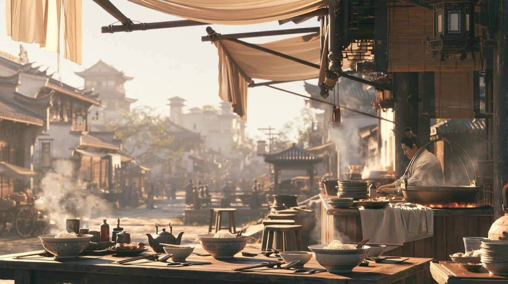
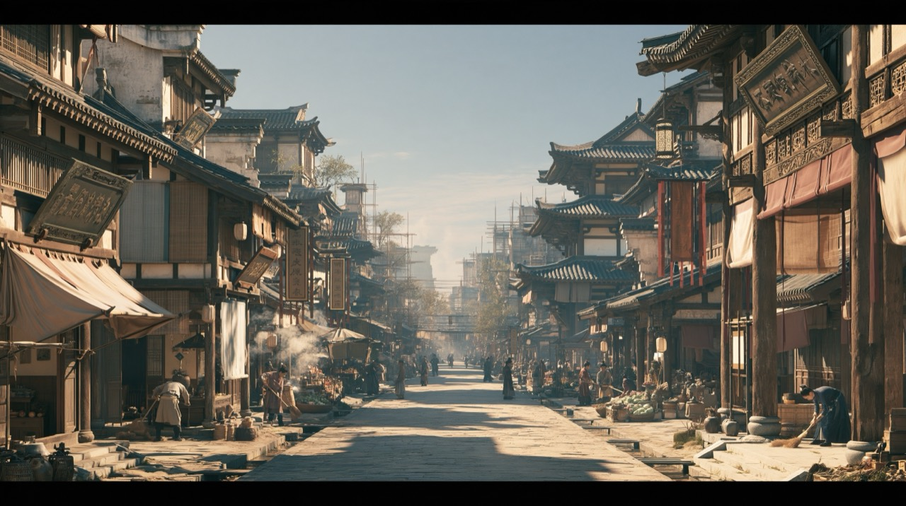
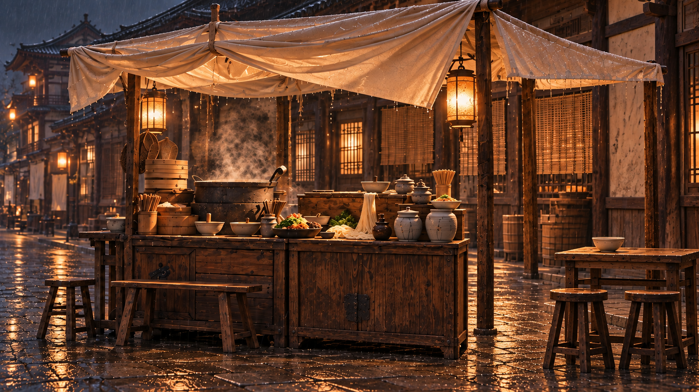

# 南街与面摊视觉参考

用户指定五图为现行风格依据；原图白昼与台本夜雨分别管理。

## 当前夜景

## 用户原图

### 参考1

### 参考2

### 参考3

### 参考4

### 参考5

当前只锁定视觉风格；场景三视图、具体邻接关系和人物反打尚未验收。

## 面摊操作近景候选

柜台左锅右案，右端留侧向出入口，邻桌与双凳位于右侧棚下。该布置服务孙福生端汤与周丁坐席；需合人验证棚柱旁净宽和普通臂长的送碗距离，尚未选为反打或完整三视图。

## 汤摊三人调度候选

[三人初态](../镜头/GJ-R02-SH002-三人初态候选.png)及[按臂姿态](../镜头/GJ-R02-SH002-按臂姿态候选.png)用于检查孙周丁坐席、碗勺去向与接触；当前使用桌后长凳，已派生本镜同机位空底；双凳操作参考不作本镜合成输入，不计场景三视图通过。

[送汤末态](../镜头/GJ-R02-SH002-送汤末态候选.png)补充同机位第三个动作落点：旧碗桌左、新汤周前、丁松手、孙实际左手落碗。棚柱遮挡和侧口绕行待连续片段核验。

[SH002同机位空底](../镜头/GJ-R02-SH002-同机位空底.png)：从三人初态去人，保留桌后长凳与柜台备汤。用于同机位合成准备，配准、补出背景及动态雨汽仍待核验。
