# 轻仙侠人物、兵器与功法视觉候选

本页展示已生成入库的14张候选。各角色身份、年龄、体型沿用现有母版；衣装以细绸、柔缎、低反差提花和有固定点的层叠衣摆与男主统一。冬装保留衬层，轻纱用于合适季节与场景。

服装的新侧背面、衣伤雨态尚未补齐，不能混入原衣套三视图后宣称同套；生成记录与复核边界以[必要资产包登记](../必要资产包登记.json)为准。

## C03-XIANXIA

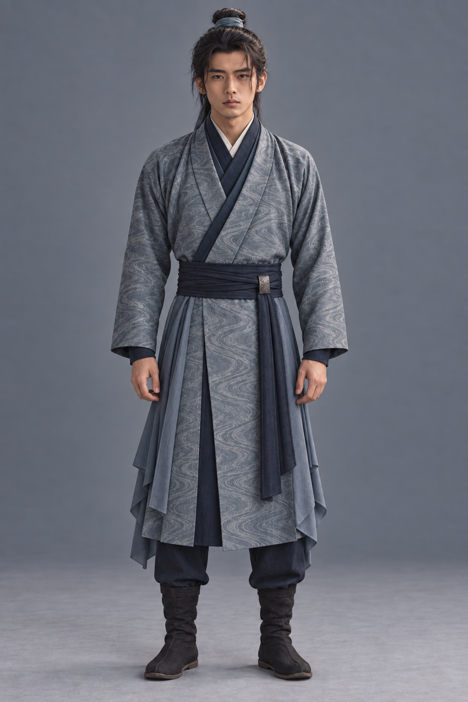

灰青水纹绸面、玄蓝腰封及层叠侧摆；面貌、布束发及收袖保留。

待核：正面试装不替代已有人物身份母版；新衣装侧背和衣伤需同步后才能连续调用；袖摆、披片与兵器接触须在动作镜头复核，不能直接拼接旧衣装侧背。

## C16-XIANXIA

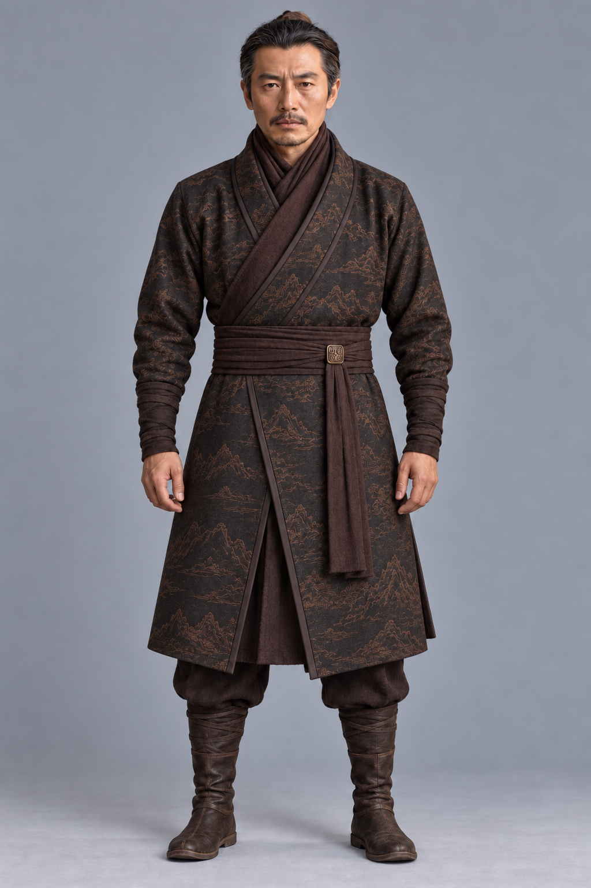

玄褐丝毛绸面、古铜断山疏纹，保留灰鬓、围巾、宽肩与收腕。

待核：正面试装不替代已有人物身份母版；新衣装侧背和衣伤需同步后才能连续调用；袖摆、披片与兵器接触须在动作镜头复核，不能直接拼接旧衣装侧背。

## C17-XIANXIA

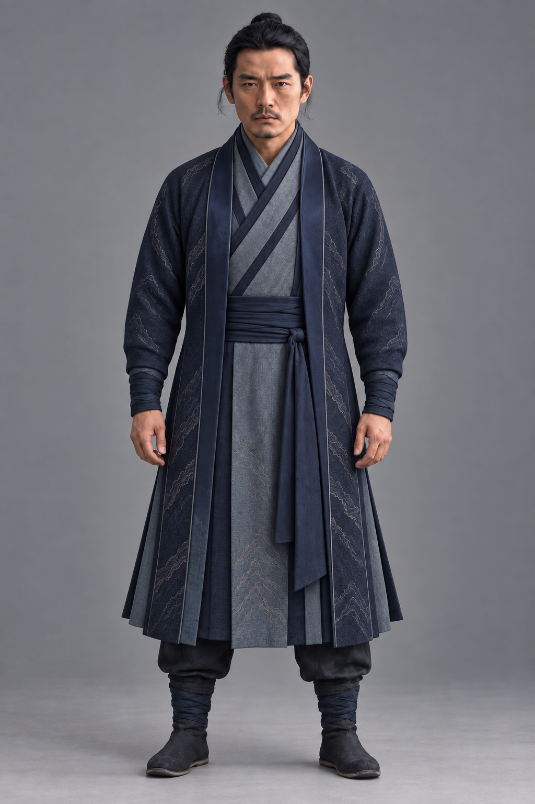

深靛绸缘、疏金属色折脊衣纹；原38岁方脸宽肩保留，纹路部分偏山形需继续收敛。

待核：正面试装不替代已有人物身份母版；新衣装侧背和衣伤需同步后才能连续调用；袖摆、披片与兵器接触须在动作镜头复核，不能直接拼接旧衣装侧背。

## C20-XIANXIA

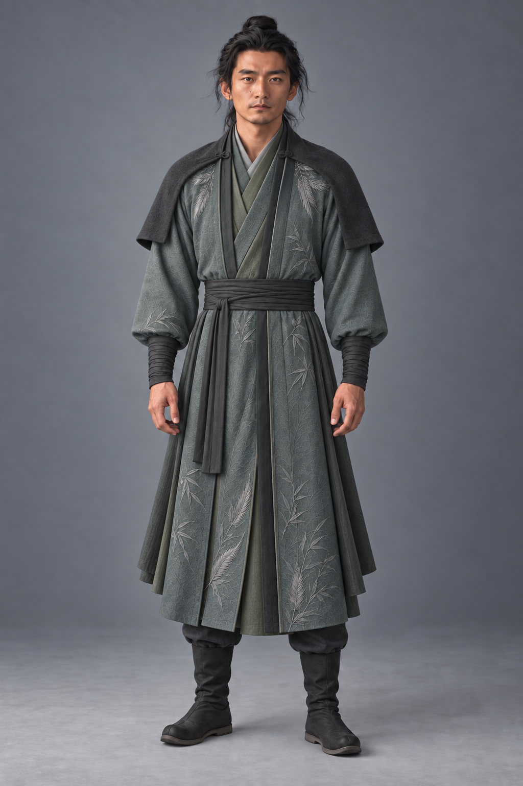

灰青竹羽纹绸袍、竹绿内层与短披肩；长躯与细肩保留，银羽装饰比原案醒目。

待核：正面试装不替代已有人物身份母版；新衣装侧背和衣伤需同步后才能连续调用；袖摆、披片与兵器接触须在动作镜头复核，不能直接拼接旧衣装侧背。

## C23-XIANXIA

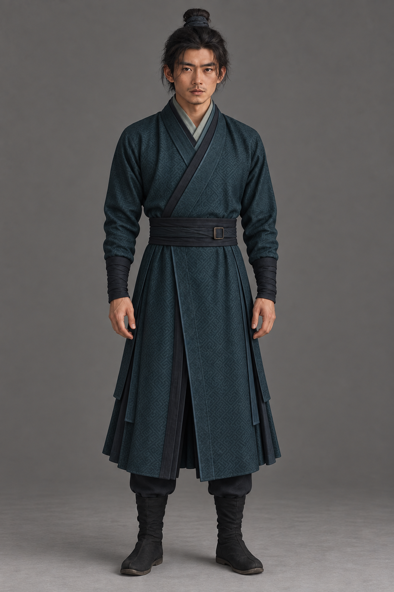

深青几何提花、青瓷灰内领与层叠侧摆，32岁窄脸、方扣和收腕保留。

待核：正面试装不替代已有人物身份母版；新衣装侧背和衣伤需同步后才能连续调用；袖摆、披片与兵器接触须在动作镜头复核，不能直接拼接旧衣装侧背。

## C04-XIANXIA

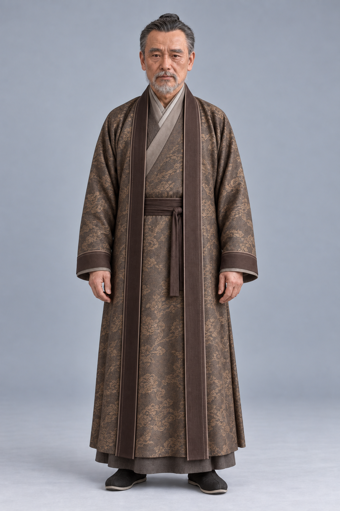

茶褐绸面云叶纹、暖灰内领与厚实垂摆，64岁须发、皱纹和体量保留。

待核：正面试装不替代已有人物身份母版；新衣装侧背和衣伤需同步后才能连续调用；袖摆、披片与兵器接触须在动作镜头复核，不能直接拼接旧衣装侧背。

## C06-XIANXIA

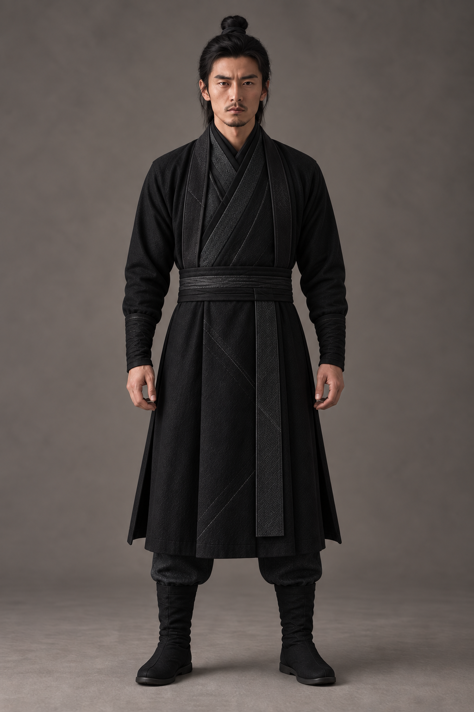

墨黑叠襟与细斜线绸纹、收腕窄腰；保留黄祁34岁面貌和短须，不加门派标识。

待核：正面试装不替代已有人物身份母版；新衣装侧背和衣伤需同步后才能连续调用；袖摆、披片与兵器接触须在动作镜头复核，不能直接拼接旧衣装侧背。

## P21-SHIELD-XIANXIA

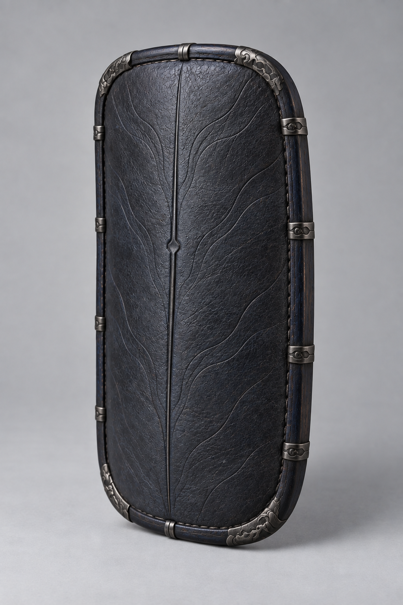

木芯皮面短盾沿原轮廓，改靛黑皮面、墨银包角和浅棱纹；非自动法盾。

待核：仅道具设计候选，人物尺度、握持、佩置与收鞘仍待核对；不增加武器法器能力；未改写既有剧情归属。

## P21-KNIFE-XIANXIA

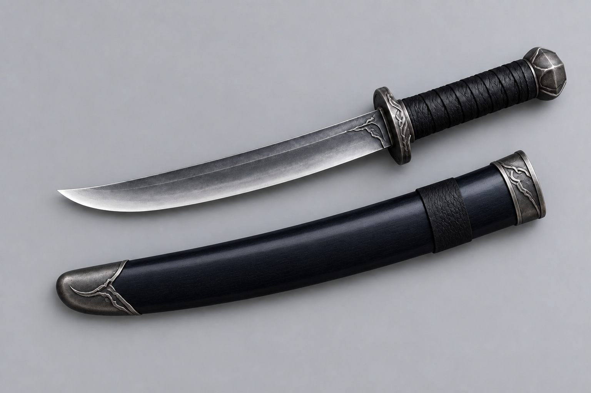

石照川短刀保留短刃与岩棱柄首，刀鞘改靛黑漆面，局部细裂纹仍可见。

待核：仅道具设计候选，人物尺度、握持、佩置与收鞘仍待核对；不增加武器法器能力；未改写既有剧情归属。

## C06-BLADE-XIANXIA

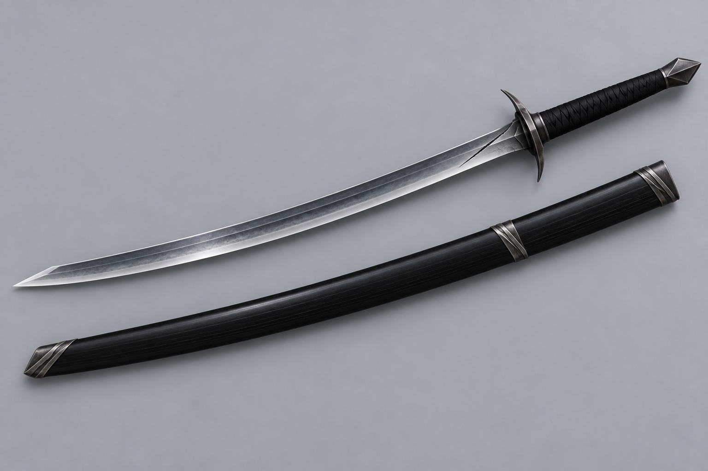

冷银窄刃、黑漆窄鞘、菱形柄首；护手偏尖、根部黑线似裂口，保持设计候选待收敛。

待核：仅道具设计候选，人物尺度、握持、佩置与收鞘仍待核对；不增加武器法器能力；未改写既有剧情归属。

## FX-BODY-QI

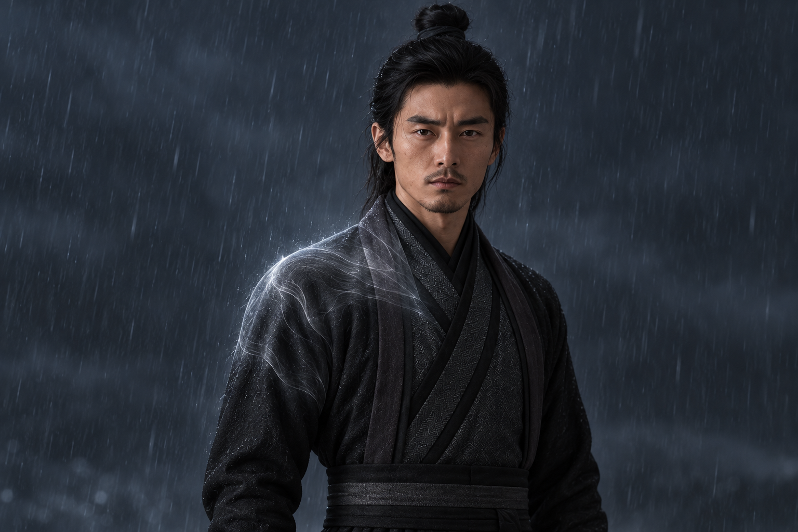

贴肩薄膜、局部丝状流纹与弱冷光，衣物可透见；不作恒常护体光环。

待核：仅有背景的静态外观参考，非透明合成素材或成片；时序、遮挡、人物受力与环境交互尚未通过，POST-FX-COPPER仍未完成。

## FX-BLADE-QI

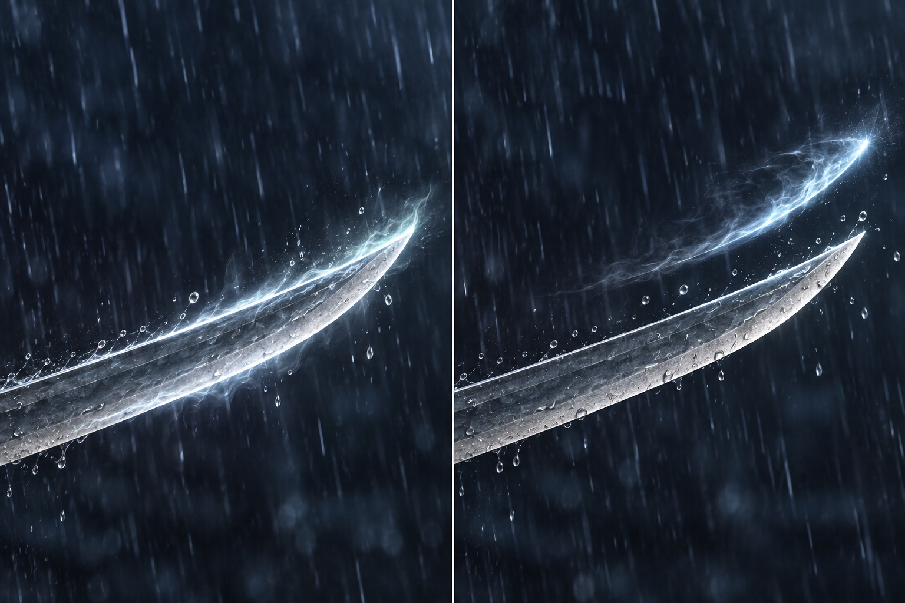

双格区分贴刃短芒与离锋短弧，右格刃气间雨线可见；光晕偏强，实镜应压低。

待核：仅有背景的静态外观参考，非透明合成素材或成片；时序、遮挡、人物受力与环境交互尚未通过，POST-FX-COPPER仍未完成。

## FX-GUIJING

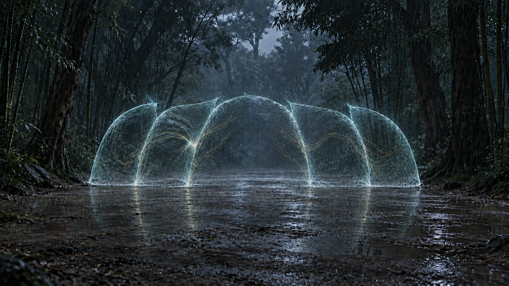

已改为柔薄青金弧面，五个相接区域和左侧受压可辨；空间体量、五人接续及动态仍待实镜核验。

待核：仅有背景的静态外观参考，非透明合成素材或成片；时序、遮挡、人物受力与环境交互尚未通过，POST-FX-COPPER仍未完成。

## FX-FIVE-SWORDS

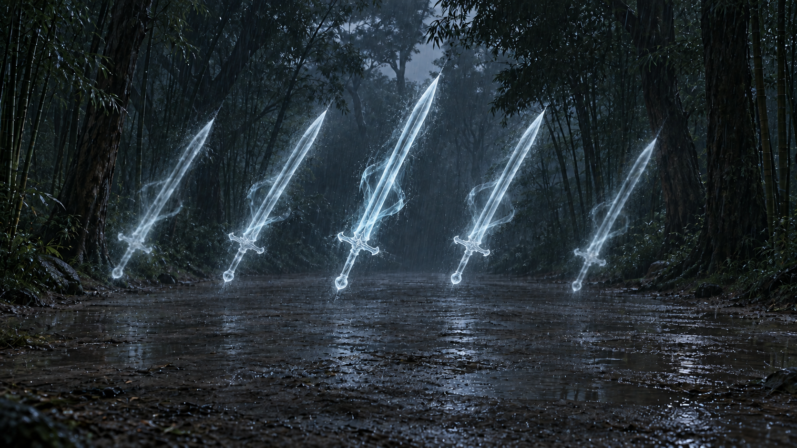

五道银青透雨剑形，中央一道计入总数，内外两对清楚；静帧不证明分化及退敌运动。

待核：仅有背景的静态外观参考，非透明合成素材或成片；时序、遮挡、人物受力与环境交互尚未通过，POST-FX-COPPER仍未完成。

## 视频调用边界

服装、兵器只提供外形参考，不增加法器设定或境界。护体气只贴身局部，刀气分附刃与离刃；归京第二波仅黄允许离刃短弧。合罡仍需五卒共同维持，第一波禁用。五剑是一道分化为总计五道，不是五道另加主剑。全部特效为静态外观参考，非透明合成层、动作验证或已完成后期任务。

顾伯同套视角：[正面](C04-XIANXIA.png)、[严格侧面](C04-XIANXIA-SIDE.png)、[背面](C04-XIANXIA-BACK.png)。均为候选；不与基础棕袍侧背混用，原身份与年龄不变。

韩青同套：[正面](C03-XIANXIA.png)、[侧面](C03-XIANXIA-SIDE.png)、[背面](C03-XIANXIA-BACK.png)。无甲干衣候选，前扣与侧片待复核。

杜长庚同套：[正面](C16-XIANXIA.png)、[侧向](C16-XIANXIA-SIDE.png)、[背面](C16-XIANXIA-BACK.png)。侧向已原位修正胸前暴露、远侧手与腰扣方向；整套仍待复核，无甲干衣不抵结阵佩兵状态。
