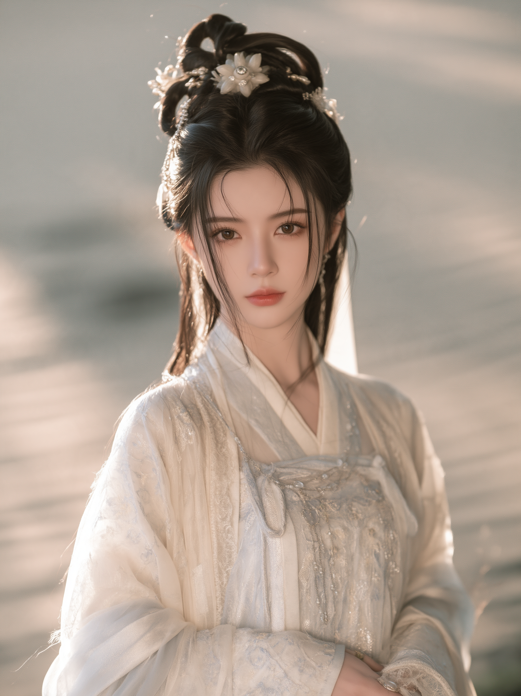
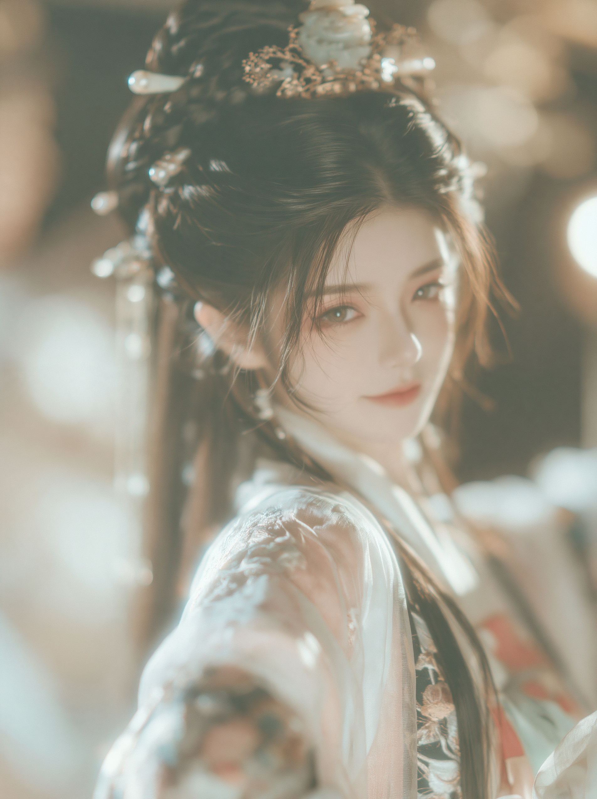
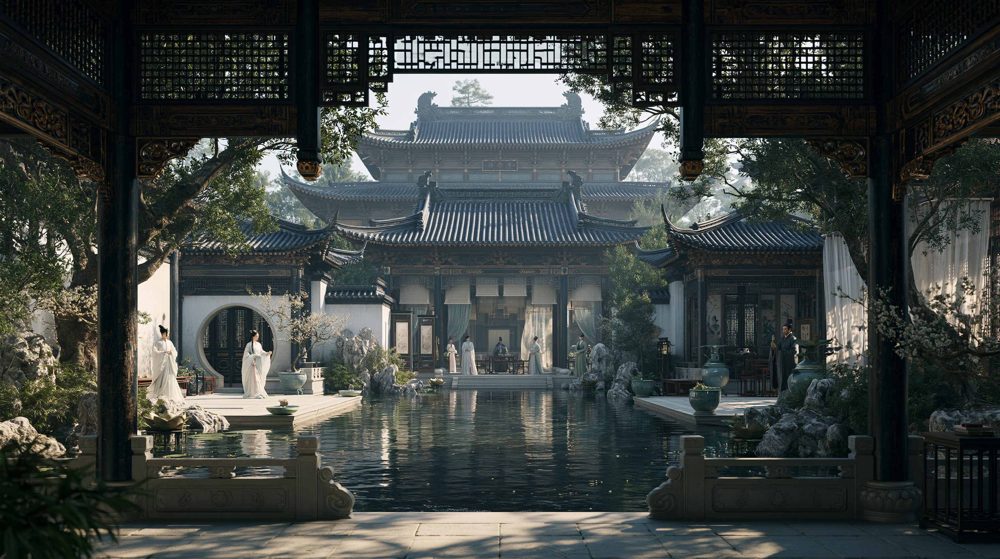
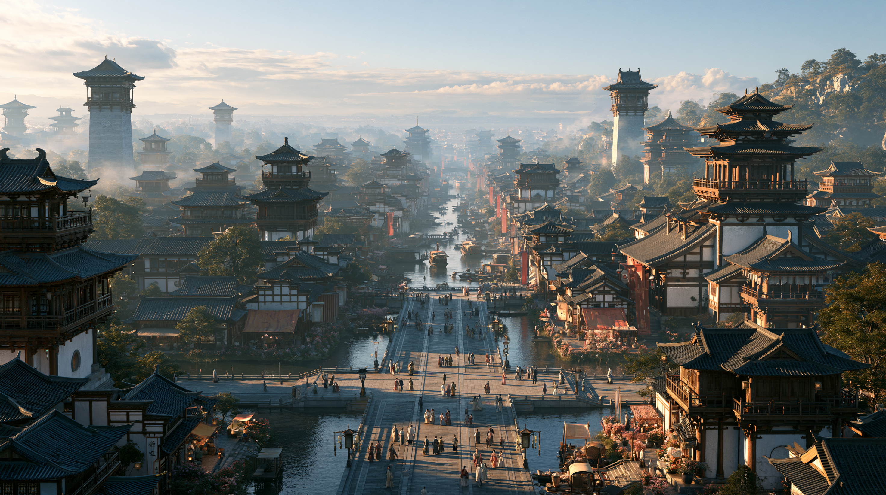

# raw参考评估与全剧风格提案

2026-09-07｜CineWeave Director 工作稿 v0.1｜状态：已观察四张完整图片；城市图在补全文件后完成复核。图像参考未自动升为定妆或场景母版。

依据：[美术总则v0.8](../../美术风格与造型总则.md)、[宁清晏角色卡](../../角色/C27-宁清晏.md)、[殷照夜角色卡](../../角色/C28-殷照夜.md)、[顾府场景卡](../../场景/S03-顾府门院前厅与西厢.md)。下一步见[MJ提示词](<../../生产准备/前三集-v1.9/MJ提示词.md>)。

## 结论

四张完整图支持“精致古装、摄影写实、温柔光线、细致衣料与木作”的共同方向。宁清晏适合作为角色造型候选；殷照夜适合作为面容与回眸表情候选，但当前衣色尚未落实她的红紫主色。院落图适合作为建筑工艺和纵深参考，不能直接成为第一集顾府的空间母版。城市图适合探索长京的繁盛与规模；具体水网和城市平面仍须另行设计。

上述“适合”是对用途的判断，不是用户已经选定。年龄与角色身份来自用户文件名和现有角色卡，不从图像推断或验证。静态肖像不能证明行动气质、跨角度身份一致或视频稳定性。

## 1. 宁清晏

原文件：1904×2544，PNG，可完整解码。用户声明目标：C27宁清晏。

| 层面 | 实际可见内容 | 与设定关系 | 建议 |
|---|---|---|---|
| 面部与神态 | 近正面、柔和的椭圆面部轮廓、较大清亮双眼，嘴角收敛，目光正视 | 可承接宁的清雅和克制；现图的面颊与眉眼比文字“疏朗长眉、清长轮廓”更柔和 | 作为面容候选保留，不为逐字匹配文字强行改脸 |
| 发式与饰物 | 高挽黑发、白花与银色细饰、少量散发 | 月白与银色体系相合，繁复程度适合正式或较讲究的造型方向 | 正式定妆可沿用；需要执行任务的状态时再收束散发、简化易摆动饰物 |
| 服装 | 月白、极浅蓝银绣、叠领、轻透外层与细密织纹 | 与月白／冰青／银主色、层叠轻绸及同色绣吻合 | 可作为衣料和配色的主要参考 |
| 光线与表面 | 暖色边光、浅景深、柔亮肤面、明亮背景柔辉 | 满足人物美感；暖光不等于她的衣服必须改暖色 | 保留温暖边光，定脸图补一个更清楚的眼、鼻、唇、发丝版本 |
| 用途边界 | 只提供一个肖像角度，未见完整步态及全身剪裁 | 不能据此宣布22岁体态、法服全貌或动作状态已验证 | 后续补侧面、全身和同场图，先确认同一人再扩展 |

参考角色的两个独立用途：面容／造型仅供C27候选评估；全剧可借的是衣料层次、柔和侧光及局部柔辉。其他人的脸形、肤色、年龄与衣色不从此图继承。

## 2. 殷照夜

原文件：1904×2544，PNG，可完整解码。用户声明目标：C28殷照夜。

| 层面 | 实际可见内容 | 与设定关系 | 建议 |
|---|---|---|---|
| 面容与表情 | 回身望来、目光有回应、嘴角轻提，脸部轮廓柔和 | 比静立更有互动感，可以承接“鲜活、主动”的一面 | 保留为面容与表情候选；不从单张推断完整性格 |
| 服装与饰物 | 大面积浅色外层、深色中层、细绣，发饰有金属和浅玉色点缀 | 画面质感相合；石榴红、胭脂和深紫未形成清楚主色，现图与宁的浅色体系过近 | 优先测试红紫衣装，不先重做一张脸；细金饰可保留 |
| 光线与清晰度 | 前景虚化较强，脸部和衣料上有明显柔雾，局部明亮光斑 | 适合作为氛围图；用于稳定身份和材质判断时信息偏软 | 保留眼神和回身关系，减少遮住脸及领口的柔雾 |
| 身份区别 | 两图均为黑发、浅色服装、柔光美人肖像 | 作为两位女主并置时，当前色彩和表面处理削弱区别 | 宁偏清长从容、月白冰青银；殷偏鲜活响应、红紫小金饰；不靠两张都变冷脸区分 |

“不符合主色”并不意味着要丢掉这张肖像。可以先选面容，再做服装状态调整；是否能在指定生成工具中保住脸，需要实际候选图验证。后续提示词里的殷是原创造型描述，不声称仅凭文字可以复刻这张参考脸。

## 3. 院落建筑

原文件：2944×1648，PNG，可完整解码；宽高比接近16:9，但不是精确16:9。

可见：门廊框景、密集木雕与格栅、层叠灰瓦屋顶、白墙、庭树和石景、较大的中央水池、临水通路及人物尺度。前景暗、庭院和远处较亮，前后层次清楚。牌匾细字未据此核读或移植。

| 可借用 | 用途 | 不应随之转移 |
|---|---|---|
| 木作与瓦面细节、白墙和深木对比 | 全剧有底蕴的建筑工艺与材质 | 未经设定确认的具体时代、真实地点、牌匾内容 |
| 门廊套景、前暗后明和层叠屋檐 | 场景构图、空间纵深 | 不可见空间的完整平面布局 |
| 日光穿过庭树与廊柱的层次 | 后续日景的采光机制参考 | 第一集的夜雨不能直接改成此图日光 |
| 精致庭院的规模感 | 可供后续较富丽场所探索，具体归属未定 | 不自动指派为宁的宗门、殷的居所或新增剧情地点 |

第一集顾府需要门院通行、前厅、东西房间、西厢和值守关系，且有褪色门漆、旧木修补和漏雨盆。图中的中央水池会改变院内通行和后续门口制敌空间；本轮顾府提示词因此保留精细木作，使用连续可步行的铺石院地，并缩到旧家宅的尺度。它是风格转换提案，不改动现有顾府拓扑。

## 4. 城市：适合长京的繁盛方向

当前完整文件：2944×1648，PNG，7721064字节，已实际查看；宽高比接近16:9。首次读取的935125字节文件曾被检出截断，随后原路径短暂缺失，再出现当前完整版本。本轮评估使用当前完整图，两个版本的实际SHA-256分别保留，不把早先失败读取当作有效画面证据。

| 层面 | 当前实际可见内容 | 与设定关系及采用建议 |
|---|---|---|
| 城市规模 | 高处俯看密集层叠楼阁、灰瓦屋顶、多座城楼，近远建筑延伸入薄雾 | 很适合长京作为繁盛架空都城的整体气势；密度与天际线可作为方向 |
| 人间活动 | 舟船、临水楼房、桥和水岸步行人群 | 与水岸、车马、营生和日常生活的审美相合；后续近景应保留人正在做事的尺度 |
| 光色与材质 | 暖色斜光、冷蓝灰远景、水面反光、深木和灰瓦、局部红色旗幌 | 可与肖像的暖边光和院落木作统一；日景与第一集冷雨夜应使用不同光照状态 |
| 地理与构图 | 水道在城市纵深中突出，前景多处分支桥路，右侧可见山势 | 水网、桥路连接和山的位置尚未成为正典；不能从单幅图推导完整城市地图，也不把本图桥直接等同春泽桥 |
| 镜头尺度 | 宏观城市景的细节比两张柔雾肖像更清楚 | 可保留清楚的近中景和薄雾远景；人物同场时保留脸部清晰，避免人像与环境像两套画风 |

本图可以成为全剧城市美术候选，不要求第一集增加航拍开场。新增EXP-CITY01仅供城市风格探索，S01和S02继续以各自现行场景卡的空间和时段为准。

## 5. 本轮可探索的统一画面规则

以下是从参考与现有设定提出的工作方案，待用户通过MJ样图选择，不自动替代美术v0.8。

| 维度 | 建议基线 | 保留的资产差异 |
|---|---|---|
| 表现形式 | 摄影写实的古装剧画面；清楚的面部、衣料和木作；亮处有轻微柔辉 | 不把全员处理成同年龄、同一脸形或同样光滑的皮肤 |
| 肤色与脸 | 有方向的柔光，眼和鼻唇在焦内，保留自然皮肤及年岁纹理 | 顾砚暖麦肤；顾伯和老卒保留成熟轮廓与细纹 |
| 衣料 | 可见经纬、接缝、厚薄、重量与自然褶皱，衣装合身 | 圣女丝绣与九卒棉毛分别成立；华丽不等于全员穿礼服 |
| 调色 | 低饱和环境托住有识别度的角色色块 | 宁月白冰青银、殷红紫金；韩灰青、杜褐、石靛、孟赭 |
| 柔雾 | 主要落在光源和背景高光；脸、手及叙事物件可读 | 肖像氛围版可更柔；定妆与道具版更清楚 |
| 建筑 | 清楚木作、石材、瓦与多层门廊；生活痕迹具体 | 顾府旧宅，南街营生，桥头通行；不用同一座豪宅复制所有地点 |
| 夜景 | 冷环境光加有来源的暖灯；湿地反光帮助读空间 | 人脸、刀与脚下仍可见；不靠压黑解决细节 |

控制实验见提示词库的顾砚A／B和书房A／B：保持内容、机位和实际光源不变，仅比较柔雾扩散范围。模型随机差异仍存在，选图时不能把所有变化都归因于单个词。

## 6. 状态、证据与后续交接

四个原文件的SHA-256、尺寸、可读状态及用途分开保存于[参考来源登记](<参考来源登记.json>)。SHA-256只用于识别本次读取的文件，不证明作者、许可或生成工具。原始图来源为用户提供本地文件；作者、生成平台、具体模型、原提示词和其他来源信息尚未提供。本轮进行本地分析，提示词默认不附带这些图片，不上传原文件。

图像属于“用户提供参考／待选”，不是第一集已完成资产。C27／C28继续维持后续大纲人物身份；它们不进入第一集出镜清单。城市图也不增加本集场次。用户选出候选后，再将通过的身份、衣装、空间和画面处理分别固定，进入高清资产制作。
